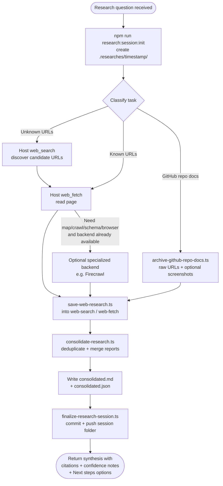

# research-online
A skill that runs end-to-end online research sessions using **whatever web search and page-fetch tools the current harness exposes**. It initialises a timestamped artifact directory, collects multi-source evidence, deduplicates and consolidates findings, and publishes a reproducible session payload — returning source-backed answers with explicit confidence notes.

Host search/fetch is the default path. Firecrawl CLI (map, crawl, schema extraction, browser) is an optional specialized backend when it is already available — not a prerequisite.

## Install

The fastest cross-agent install path is the `skills` CLI:

```bash
npx skills add gg-skills/research-online
```

Drop this skill into a workspace as a Git submodule for pinned versions, or as a plain clone for latest `main`:

```bash
# Project-local, version-pinned:
git submodule add git@github.com:gg-skills/research-online.git .claude/skills/research-online

# OR project-local, latest main:
mkdir -p .claude/skills
git -C .claude/skills clone git@github.com:gg-skills/research-online.git

# OR user-level, available in every project on this machine:
mkdir -p ~/.claude/skills
git -C ~/.claude/skills clone git@github.com:gg-skills/research-online.git
```

Restart your agent or reload skills after installation. See the parent [`skills` catalog repo](https://github.com/gg-skills/skills) for the full catalog.

## When to use

- User asks for current web information, multi-source discovery, or site mapping.
- Task requires structured extraction from web pages or autonomous research.
- Research involves comparing documentation across multiple sites.
- Need to verify a claim against live web sources.
- Working with GitHub repository documentation that needs faithful archival.

Skip when the question can be answered from the local codebase or committed documentation, when the user explicitly asks for opinion or creative writing without factual grounding, or when a sibling skill already covers a specific tool surface in isolation (this skill still owns the research session).

## How it operates

### Inputs

| Input | Description |
|-------|-------------|
| Research question | Free-text query passed via `--query` to session-init and consolidation scripts. |
| Target sources | Optional: explicit URLs for fetch/scrape/crawl, or left open for search-driven discovery. |
| Freshness requirements | Optional: cache-age hint for a specialized scrape backend during iterative runs. |
| GitHub repo target | Optional: `--github-repo` and `--branch` flags for the archival script path. |
| Format preference | Optional: `thematic`, `chronological`, or `source` passed to `consolidate-research.ts`. |

### Outputs

| Output | Location |
|--------|----------|
| Session metadata | `.researches/<timestamp>/metadata.json` |
| Host search artifacts | `.researches/<timestamp>/web-search/` |
| Host fetch artifacts | `.researches/<timestamp>/web-fetch/` |
| Hybrid search+fetch artifacts | `.researches/<timestamp>/web-research/` |
| Specialized-backend dumps (optional) | `.researches/<timestamp>/firecrawl/raw/` (only if Firecrawl was used) |
| Specialized-backend reports (optional) | `.researches/<timestamp>/firecrawl/reports/` |
| Documentation markdown | `.researches/<timestamp>/documentation/markdown/` |
| Documentation HTML | `.researches/<timestamp>/documentation/html/` |
| Full-page screenshots | `.researches/<timestamp>/documentation/screenshots/full-page/` |
| Subagent reports | `.researches/<timestamp>/subagent-reports/` |
| Consolidated markdown | `.researches/<timestamp>/consolidated.md` |
| Consolidated JSON | `.researches/<timestamp>/consolidated.json` |

### External commands

Default path (any harness that exposes search or fetch):

| Command | Purpose |
|---------|---------|
| Host `web_search` (or equivalent) | Discovery — locate candidate URLs from a query. Names vary by harness. |
| Host `web_fetch` (or equivalent) | Single-page read of a known URL. Names vary (`web_fetch`, `WebFetch`, `open_page`, MCP fetch). |
| `npm run research:session:init` | Bootstraps the timestamped session directory and writes `metadata.json`. |
| `npx tsx scripts/save-web-research.ts` | Persists host search/fetch results into the session. |
| `npx tsx scripts/consolidate-research.ts` | Deduplicates and merges reports into `consolidated.md` + `consolidated.json`. |
| `npx tsx scripts/finalize-research-session.ts` | Publishes the completed session with a scoped commit/push. |
| `npx tsx scripts/archive-github-repo-docs.ts` | Archives GitHub repo docs via raw URLs + optional screenshots, bypassing blob-page noise. |

Optional specialized backend (only if already installed and authenticated):

| Command | Purpose |
|---------|---------|
| `firecrawl map` | Site structure enumeration for known domains. |
| `firecrawl scrape` | Single-page extraction in markdown and/or HTML. |
| `firecrawl crawl` | Multi-page recursive extraction with `--limit` and `--max-depth` guards. |
| `firecrawl agent` | Autonomous structured extraction; used only when a schema is required or deterministic commands fail. |
| `firecrawl browser` | JS-heavy or interactive page fallback; version-dependent — prefer explicit `firecrawl browser execute --node …` over shorthand. |
| `firecrawl search` | Alternate discovery when host search is insufficient. |

### Side effects

- **File writes** — session directory tree created under `.researches/<timestamp>/` in the working project.
- **Network requests** — host search/fetch calls; optional Firecrawl API calls only if that backend is used (those cost real API credits).
- **Git commits/push** — `finalize-research-session.ts` commits and pushes the session folder when `--dry-run` is not set.
- **Environment variable** — `FIRECRAWL_OUTPUT_DIR` is set per session only when Firecrawl is actually used; `FIRECRAWL_API_KEY` is not required for the default path.

### Mode toggles

| Toggle | Effect |
|--------|--------|
| `--no-publish` | Skip commit/push at finalize step; keeps session local. |
| `--dry-run` | Print what would be committed without writing to remote. |
| `--no-dedupe` | Disable deduplication in consolidation; useful when source overlap is intentional. |
| `--max-age <seconds>` | Allow specialized-backend cache hits; lowers cost during iterative debugging (Firecrawl path only). |
| `--screenshot-mode` | Enable full-page screenshot capture in the archival script. |

## Operational flow



## Layout

```
research-online/
├── SKILL.md                         # Skill descriptor and full policy
├── README.md                        # This file
├── agents/
│   └── openai.yaml                  # Agent definition
├── assets/                          # Skill icons
│   ├── icon-large.png / .svg
│   └── icon-small.svg
├── references/
│   ├── consolidation-patterns.md    # Six strategies for merging subagent findings
│   ├── github-repository-doc-archival.md  # Hybrid archival pattern for GitHub repos
│   ├── harness-patterns.md          # Parallelisation patterns (host search/fetch default)
│   └── tool-selection.md            # Host-first decision tree + optional Firecrawl commands
└── scripts/
    ├── init-research-session.ts     # Bootstrap timestamped session directory
    ├── save-research.ts             # Import pre-existing temp files into a session
    ├── consolidate-research.ts      # Deduplicate and merge into consolidated outputs
    ├── finalize-research-session.ts # Publish completed session via commit/push
    ├── archive-github-repo-docs.ts  # Archive GitHub repo docs faithfully
    └── research-session.ts          # Library: session directory layout helpers
```

## Quick start

```bash
# 1. Initialise a session (no Firecrawl pre-flight)
npm run research:session:init -- --query "What changed in Next.js 15?"

# 2. Discover with the host's search tool, then fetch 1–2 URLs.
#    Persist results (names of host tools vary by harness):
npx tsx .agents/skills/research-online/scripts/save-web-research.ts \
  --query "What changed in Next.js 15?" \
  --source search \
  --content '{"results": [...]}'

# 3. Consolidate whatever the session collected
npx tsx .agents/skills/research-online/scripts/consolidate-research.ts \
  --auto-session \
  --query "What changed in Next.js 15?" \
  --format thematic

# 4. Publish
npx tsx .agents/skills/research-online/scripts/finalize-research-session.ts \
  --latest
```

## Resources

- Host search/fetch tools provided by the current harness (required default path).
- [firecrawl](https://github.com/gg-skills/firecrawl) — optional low-level CLI primer; load only when that backend is already available and you need command syntax.
- [Firecrawl documentation](https://docs.firecrawl.dev) — upstream reference for the optional backend.
- `references/tool-selection.md` — host-first decision tree and optional Firecrawl command patterns.
- `references/harness-patterns.md` — parallelisation patterns for high fan-out research.

## Caveats

- **Host search/fetch is the default.** Do not require Firecrawl or any other named vendor. Specialized backends are optional extras when already available.
- **Never block on backend setup.** Missing Firecrawl is not a research failure. Complete with host tools and note any capability gap.
- **Specialized-backend credits are real money.** If Firecrawl (or equivalent) is used, scope crawls with `--limit` and `--max-depth`; escalate to `agent`/`browser` only when cheaper commands fail.
- **Dual representation contract.** Documentation targets must be saved in both markdown and HTML; markdown-only is incomplete.
- **GitHub blob pages are noisy.** Use `raw.githubusercontent.com` URLs or `archive-github-repo-docs.ts` — never scrape the blob-rendered page as canonical source text.
- **`firecrawl browser` shorthand is fragile.** It is version-dependent; prefer `firecrawl browser execute --node …` explicitly — only relevant when that CLI is in use.
